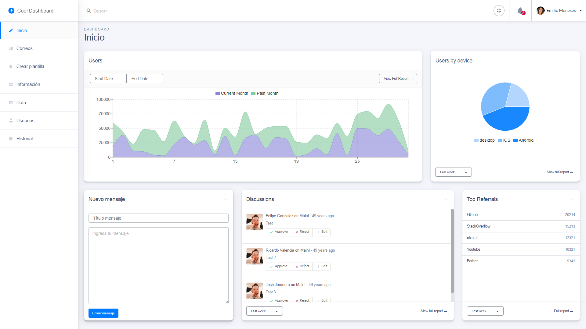

# CoolDashboard
> Solución a Postulación de Desarrollo FrontEnd para Jumpitt - Creación del Dashboard Cool.

Ejemplo representativo de la solución.



## Installation

OS X, Linux & Windows:

```sh
npm install
```

## Run

OS X, Linux & Windows:

```sh
npm run build:dev
```

## Desarrollado con

React.js + Redux

## Librerías Utilizadas

Moment
> Transformar timestamp a formato DD-MM-YYYY.

```sh
npm install moment --save
```

D3-Scale
> Librería d3.

```sh
npm install d3-scale --save
```

Recharts
> Librería para la creación de graficos.

```sh
npm install recharts --save
```

Calendar
> Librería para la creación de calendario.

```sh
npm install rc-calendar --save
```

Semantic UI
> Paquete que proporciona algunos componentes estructurados.

```sh
npm install semantic-ui-css --save
npm install semantic-ui-react --save
```

Fullscreen / Roddy Vitali
> Plugin para activar y desactivar pantalla completa.

```sh
npm install @roddyvitali/fullscreen-js --save
```

## Credits

Roddy Vitali – [@roddyvitali](https://twitter.com/roddyvitali) – roddicks@gmail.com
[https://github.com/roddyvitali](https://github.com/roddyvitali/)

## License

- [MIT](https://github.com/roddyvitali/rut-utils/tree/master/LICENSE)
